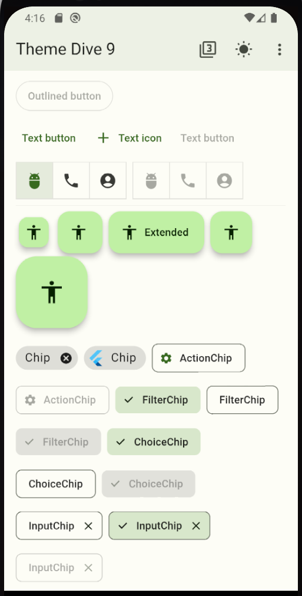

# Book

## Usage

- The project mainly works with ThemeData.
- The Books screen applied the CardTheme from ThemeData and the customized BookThemeStyle's attribute for the AppBar's title.

  

- The Detail screen applied the dynamic color from the book's cover.

  

- We can see the previewed Theme from a source color in [preview_theme_main](lib/preview_theme_main.dart).

  

  

## License

This project is Copyright (c) 2014 and onwards. It is free software,
and may be redistributed under the terms specified in the [LICENSE] file.

[LICENSE]: /LICENSE

## About

This project is maintained and funded by Nimble.

We love open source and do our part in sharing our work with the community!
See [our other projects][community] or [hire our team][hire] to help build your product.

[community]: https://github.com/nimblehq
[hire]: https://nimblehq.co/
