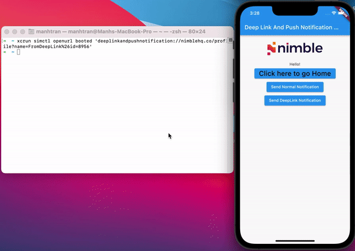

# Deeplink And Push Notification

## Usage

- The project mainly works with deeplink and push notification.
- There are two deeplinks in the application, they are `/home` and `/profile?name={YOUR_NAME}&id={YOUR_ID}`.
- Test the deeplink with iOS:
  - `$ xcrun simctl openurl booted 'deeplinkandpushnotification://nimblehq.co/profile?name=FromDeepLink%26id=8956'`
  
- Test the deeplink with Android:
  - `$ adb shell am start -W -a android.intent.action.VIEW -d "deeplinkandpushnotification://nimblehq.co/profile?name=FromDeepLink%26id=555" co.nimblehq.deeplinkandpushnotification.staging`
  

## License

This project is Copyright (c) 2014 and onwards. It is free software,
and may be redistributed under the terms specified in the [LICENSE] file.

[LICENSE]: /LICENSE

## About

This project is maintained and funded by Nimble.

We love open source and do our part in sharing our work with the community!
See [our other projects][community] or [hire our team][hire] to help build your product.

[community]: https://github.com/nimblehq
[hire]: https://nimblehq.co/
