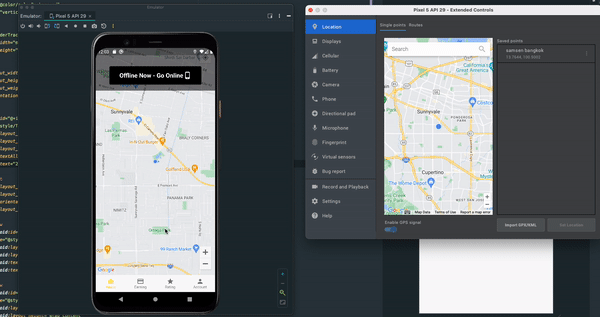

# Realtime Location Tracking

## Usage

- Flutter 3.3.8
- To make the application work, please provide `google-services.json`, and Google API keys (Map SDK enabled).
- For Firebase integration, enable:
  - Realtime Database.
  - Authentication with email/ password.
  - Storage.
- For Google API key, add it to:
  - For Android:
    - `lib/config_map.dart`, in `mapKeyAndroid` variable.
    - `android/app/src/main/AndroidManifest.xml`, in meta-data `com.google.android.geo.API_KEY`'s value.
  - For iOS (TBD)
- The project mainly works with realtime location tracking.

## License

This project is Copyright (c) 2014 and onwards. It is free software,
and may be redistributed under the terms specified in the [LICENSE] file.

[LICENSE]: /LICENSE

## About

This project is maintained and funded by Nimble.

We love open source and do our part in sharing our work with the community!
See [our other projects][community] or [hire our team][hire] to help build your product.

[community]: https://github.com/nimblehq
[hire]: https://nimblehq.co/
